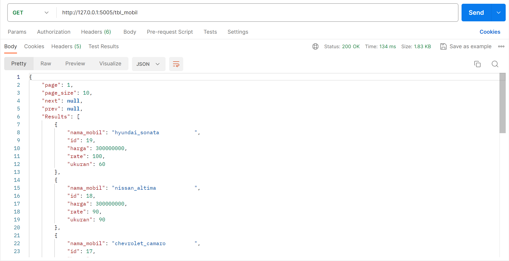
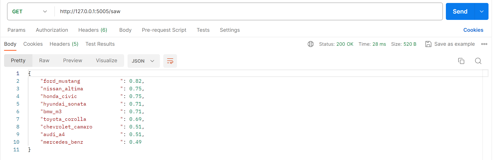
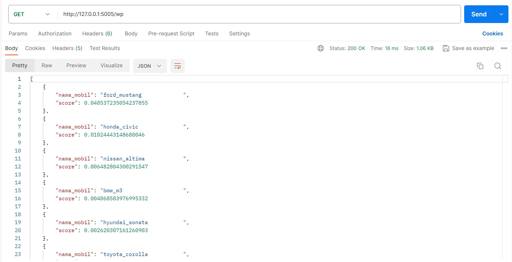
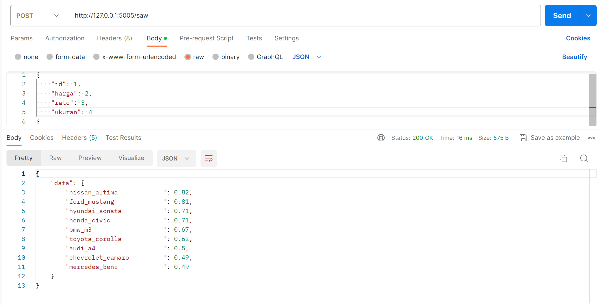
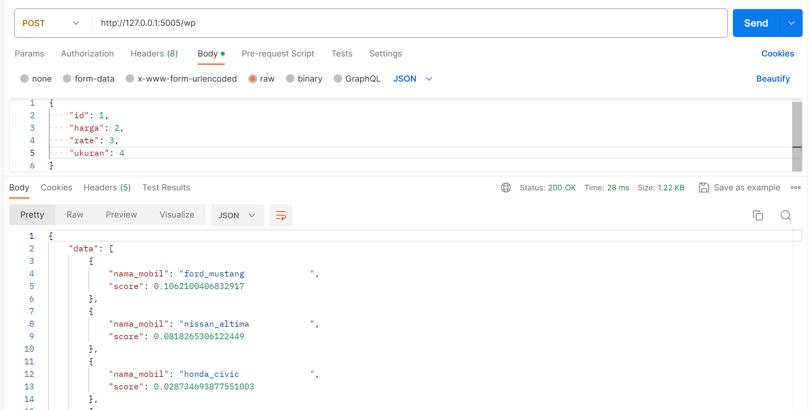

# UAS spk_web

## Install, create and activate virtualenv
https://medium.com/analytics-vidhya/virtual-environment-6ad5d9b6af59

## Install requirements

    pip install -r requirements.txt

## Run the app
to run the web app simply  use

    python main.py

## Usage
Install postman 
https://www.postman.com/downloads/

get mobil list

get recommendations saw

get recommendations wp

### TUGAS UAS
Implementasikan model yang sudah anda buat ke dalam web api dengan http method `POST`, contoh implemantasinya dapat dilihat pada repositori ini untuk api recommendation, 

INPUT:
{
    "id": 1,
    "harga": 2,
    "rate": 3,
    "ukuran": 4
}

OUTPUT (diurutkan / sort dari yang terbesar ke yang terkecil):

post recommendations saw

post recommendations wp

